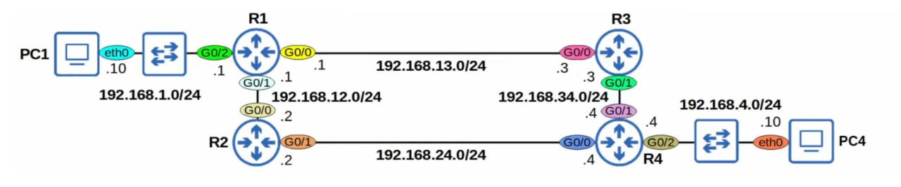

# Question 3: Static Routing Configuration

## Overview

Design and implement a network in **Cisco Packet Tracer** based on the provided network topology diagram.

**Tool:** Cisco Packet Tracer

---

## Network Topology

Please refer to the **diagram.jpg** file for the network topology you need to implement.

---

## Requirements

### 1. Network Design

- Recreate the network topology shown in **diagram.jpg** in Cisco Packet Tracer
- Configure all routers and PCs according to the diagram

### 2. Static Routing Configuration

- Configure **static routes** on all routers
- The route from **R1 to R3** must have a **better metric** than the route from **R1 to R2**
- Ensure proper routing between all network segments

### 3. Connectivity Testing

- Test connectivity by **ping** between the two PCs
- Verify that packets follow the optimal path (R1 → R3 should be preferred over R1 → R2)
- Document successful ping results

### 4. Device Configuration

- **Label all devices** appropriately
- **Change hostnames** on all routers and devices
- Use clear and meaningful names

---

## Deliverables

1. **Cisco Packet Tracer file (.pkt)** with complete network implementation
2. **Screenshots** showing:
   - Successful ping between PCs
   - Static route configurations on all routers
   - Routing tables showing the preferred path
3. **Configuration file** or document with router configurations

---

## Tips

- Use the `show ip route` command to verify routing tables
- Use the `traceroute` command to verify the path packets take
- Ensure all interfaces are up and properly configured
- Test connectivity before final submission
